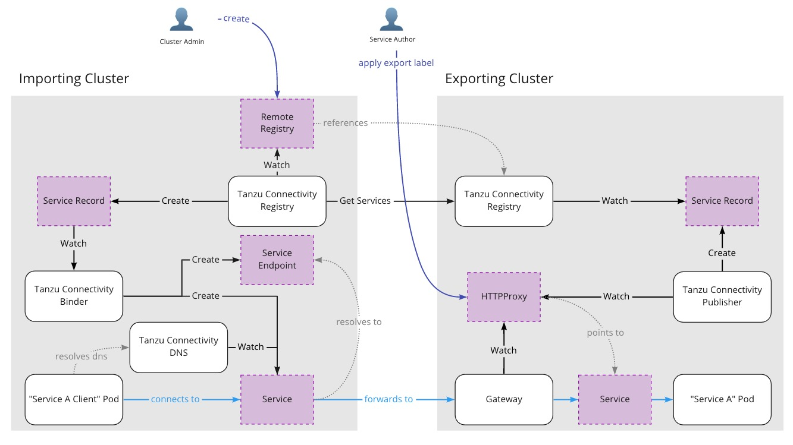
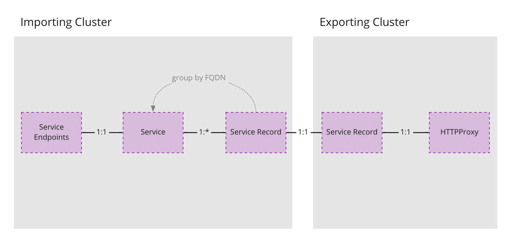

# Architecture

This project is currently in the pre-alpha stage and the following architecture
is subject to and will probably change.



The following is a diagram of how the resources relate to one another:



Note: Service Records with the same FQDN from multiple clusters will be merged
into a single Service on the importing cluster. Service Records are unique to a
specific FQDN and remote registry.

## Exporting a Service

A Service becomes exported by applying the
`connectivity.tanzu.vmware.com/export` label to a Contour `HTTPProxy` resource.

```yaml
---
apiVersion: projectcontour.io/v1
kind: HTTPProxy
metadata:
  name: my-service-ingress
  namespace: my-namespace
  labels:
    app: my-service
    connectivity.tanzu.vmware.com/export: ""
spec:
  virtualhost:
    fqdn: my-service.xcc.test
  routes:
  - services:
    - name: my-service
      port: 80
```

The `connectivity-publisher` controller is watching for Contour
`HTTPProxy` resources with `connectivity.tanzu.vmware.com/export` labels. A
`ServiceRecord` resource for each `HTTPProxy` resource.

The `connectivity-publisher` assumes that Contour is configured to listen
on port 443 on a Node. It will provide every Node IP and port 443 as the set of
endpoints for the `ServiceRecord`.

Note: This interface is most likely to change with the goal of supporting other
ingress controllers aside from Contour.

## Service Records

A Service Record defines a fully qualified domain name (FQDN) and the endpoints
for that Service. The endpoints must be reachable by all the clusters that want
to consume the Service. A `ServiceRecord` resource is created to export a
Service and to import a Service. They are differentiated by a label; an
exporting `ServiceRecord` will be labeled with
`connectivity.tanzu.vmware.com/export` and an importing `ServiceRecord` will be
labeled with `connectivity.tanzu.vmware.com/imported`.

```yaml
---
apiVersion: connectivity.tanzu.vmware.com/v1alpha1
kind: ServiceRecord
metadata:
  annotations:
    connectivity.tanzu.vmware.com/service-port: "443"
  labels:
    connectivity.tanzu.vmware.com/export: ""
  name: my-service.xcc.test
  namespace: cross-cluster-connectivity
spec:
  endpoints:
  - address: 172.17.0.5
    port: 443
  fqdn: my-service.xcc.test
```

The `connectivity-registry` controller watches for `ServiceRecord`
resources with the `connectivity.tanzu.vmware.com/export` label and waits to
serve these records using a [Hamlet](https://github.com/vmware/hamlet) server.

### Importing Service Records

On importing clusters, there is another `connectivity-registry`
controller. The controller is configured with the `RemoteRegistry` resource [see
[Remote Registries](#remote-registries)]. For each Hamlet `FederatedService` the
controller retrieves from remote registries using the Hamlet protocol, it will
create a `ServiceRecord` resource with the
`connectivity.tanzu.vmware.com/imported` label.

```yaml
---
apiVersion: connectivity.tanzu.vmware.com/v1alpha1
kind: ServiceRecord
metadata:
  annotations:
    connectivity.tanzu.vmware.com/service-port: "443"
  labels:
    connectivity.tanzu.vmware.com/imported: ""
    connectivity.tanzu.vmware.com/remote-registry: shared-services-registry
  name: my-service.xcc.test-64666f63
  namespace: cross-cluster-connectivity
spec:
  endpoints:
  - address: 172.17.0.5
    port: 443
  fqdn: my-service.xcc.test
```

For each unique FQDN in the `ServiceRecord` resources, the
`connectivity-binder` controller will create a `Service` and `Endpoint`
resource. If there are multiple remote registries exporting the same FQDN, they
will be merged together.

The `Service` is created with the `ClusterIP` type and without a selector.

```yaml
---
apiVersion: v1
kind: Service
metadata:
  name: my-service-xcc-test-2bd16853
  namespace: cross-cluster-connectivity
  ownerReferences:
  - apiVersion: connectivity.tanzu.vmware.com/v1alpha1
    kind: ServiceRecord
    name: my-service.xcc.test-64666f63
    uid: edc1c191-b4e2-4016-947c-a64553647175
spec:
  clusterIP: 10.107.52.250
  ports:
  - port: 443
    protocol: TCP
    targetPort: 443
  type: ClusterIP
```

The `Endpoint` resource is created to provide the `Service` above with the
endpoints of all the `ServiceRecord` resources that have been imported.

```yaml
---
apiVersion: v1
kind: Endpoints
metadata:
  name: my-service-xcc-test-2bd16853
  namespace: cross-cluster-connectivity
  ownerReferences:
  - apiVersion: connectivity.tanzu.vmware.com/v1alpha1
    kind: ServiceRecord
    name: my-service.xcc.test-64666f63
    uid: edc1c191-b4e2-4016-947c-a64553647175
subsets:
- addresses:
  - ip: 172.17.0.5
  ports:
  - port: 443
    protocol: TCP
```

## Consuming a Service

A process within the importing cluster can use the FQDN of the Service to
connect to the exported Service.

The `connectivity-dns` controller provides DNS for a specific set of DNS
zones to all pods within the importing cluster. When a DNS request is made to
the in-cluster DNS, the request will be forwarded to the
`connectivity-dns` server, which will process the request and return a DNS
A Record with the `ClusterIP`. The controller watches for `Services` with the
`connectivity.tanzu.vmware.com/fqdn` annotations. It will cache the FQDN from
the annotation and the `ClusterIP` of the `Service`.

It is expected that the importing cluster configures the in-cluster DNS to
forward a zone (or zones) to the `connectivity-dns`. The FQDNs used by the
imported `ServiceRecords` must be within the DNS zones configured.

## Remote Registries

The `RemoteRegistry` resource configures the `connectivity-registry`
controller to query a Hamlet server. It contains the address of the server and
the service CA certificate plus the server name to validate TLS configuration.

```yaml
---
apiVersion: connectivity.tanzu.vmware.com/v1alpha1
kind: RemoteRegistry
metadata:
  name: shared-services-registry
  namespace: cross-cluster-connectivity
spec:
  address: shared-services-registry.cross-cluster-connectivity.svc:443
  tlsConfig:
    serverCA: SERVER_CA_CERTIFICATE
    serverName: shared-services-registry.xcc.test
```
